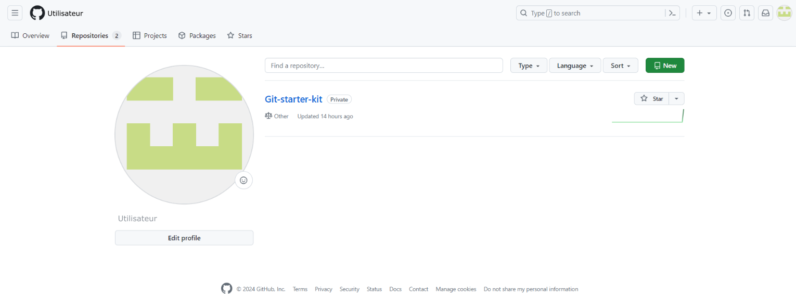

# Git-starter-kit

## Modalités de la formation

Cette formation s'adresse au personne de toute communauté voulant débuter dans la gestion de version de script et la sécurisation de leurs travaux. Cette formation est sous forme d'exercice pratique. Un dépôt GitHub est disponible avec les examples présenté en atelier.

### Prérequis

- Système d'exploitation demandé : Linux ou Windows 10 / 11 avec [WSL2](https://learn.microsoft.com/fr-fr/windows/wsl/about) 
- Notion de base des commandes Unix

### Objectifs 

- Créer un dépôt local et distant 
- Modifier / ajouter / supprimer des fichiers
- Gestion des commits
- Notion de branch / merge
- Ouverture vers la collaboration

## Mise en place des outils

### Installation
- Installation de WSL2 suivre les instructions de ce [site](https://learn.microsoft.com/fr-fr/windows/wsl/install) 
- Installation de Git :
+ Pour les distributions basées sur Debian, telle que Ubuntu, veuillez ouvrir votre terminal Linux est rentrer la commande :
```bash
$ sudo apt install git-all ## Installation de git
$ git --version ## Verification de l'installation
```
- Pour les distributions basées sur RPM (Redhat Package Manager), telle que Fedora veuillez vous référer à l'installation proposé par ce [lien](https://git-scm.com/book/fr/v2/D%C3%A9marrage-rapide-Installation-de-Git)


### Création de compte

Pour créer un compte GitHub, veuillez vous rendre sur le site de [GitHub](https://github.com/), cliquez sur le bouton Sign Up présent sur la page d'accueil.


Renseignez les informations demandés dans les champs.


Renseignez les informations demandés dans les champs.


Résolvez le captcha.


Un code de vérification vous sera envoyé sur votre adresse e-mail afin de confirmer votre identité.

Par défaut vous avez accès à la version gratuite de GitHub, mais il faut savoir que des versions payantes sont disponibles proposant plus de fonctionnalités en fonction des besoins de l'utilisateur. 


## Partie théorique

Un gestionnaire de version est un logiciel qui permet aux utilisateurs de conserver un historique des modifications et des versions de tous leurs fichiers. 
Il va garder :
-	une trace de chaque modification réalisée sur chaque fichier, 
-	un descriptif de cette modification donné par l’utilisateur
-	le nom de l’utilisateur qui l’a modifié.

Les gestionnaires de versions sont utiles aussi bien en travail personnel qu’en collaboration. Leurs objectifs seront légèrement différents suivant l’utilité que vous en ferez.

-	Travail personnel : il permet de garder un suivi des modifications que vous avez apporté et de revenir à une version précédente au besoin.
-	Travail en équipe : Permet de fusionner les modifications de chaque membres du groupe en gardant une trace des actions de chacun. Et bien évidemment, il permet de revenir à des versions précédentes également afin d'éviter de supprimer le travail des autres.

Ici nous introduirons le gestionnaire de version Git, ainsi que les plateformes en ligne associées.

**Reprenons avec ces outils !**

Git est le gestionnaire, il sert pour la création d’un dépôt local et pour gérer les versions des fichiers. GitHub / GitLab /  Bitbucket sont donc des services en ligne, qui héberge le dépôt distant. Il permet de stocker les différentes versions de votre code afin de garder un historique délocalisé pour assurer d’avoir une copie sur un réseau de vos travaux. 
Vous allez donc avoir deux copies de votre projet, une en local et une en distanciel. C’est en local que les modifications des fichiers vont être réalisées et c’est en distanciel que les fichiers vont être stockés et diffusés au besoin si le dépôt est en public. 

Mais du coup quelle est la différence entre GitHub, GitLab et Bitbucket ?

GitHub est donc une interface web permettant la communication et la collaboration entre plusieurs développeurs, il permet de contribuer à des projets open source (projets où le code est conçu pour être accessible au public). Cependant, il est sous la tutelle de Microsoft ainsi pas mal de fonctionnalités gratuites sont limités et Microsoft peut avoir accès à toutes vos ressources. Afin de contrer ça GitLab a été créé.
GitLab est l’alternative à GitHub, qui propose une version gratuite plus développée, GitLab peut être hébergé par les services de GitLab ou peut être hébergé directement sur vos propres serveurs.

Il faut savoir qu'il existe une autre plateforme Bitbucket en version gratuite qui est la préférence des utilisateurs de Atlassian (éditeur de logiciel). 

Pour notre atelier, nous vous proposons l'utilisation de GitHub / GitLab.


## Découverte de la plateforme GitLab / GitHub

### Overview

La partie overview vous donne un aperçu de votre activité sur la plateforme.


### Repositories 

Dans cet espace vous trouverez une liste tous vos dépôts distants qu'ils soient privés ou publics.



### Création du projet

Initialiser votre Git :

Rentrer les commandes 
git config --global user.name "votre nom / pseudo"
git config --global user.email "user@example.com"
