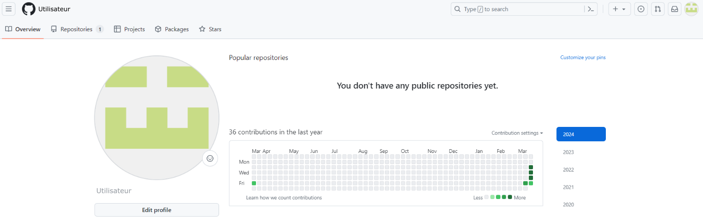
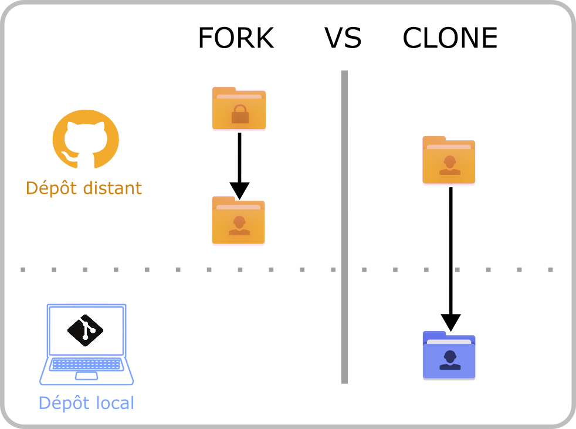

# <div align="center">  </div>

<!-- BADGES -->
<div align="center">

[![Licence][license-shield]][license-url]
[![LinkedIn][linkedin-shield]][linkedin-url]

</div>

<!-- TABLE DES MATIERES -->
<details>
  <summary>Table of Contents</summary>
  <ol>
    <li>
      <a href="#modalités-de-la-formation">Modalités de la formation</a>
      <ul>
        <li><a href="#prérequis">Prérequis</a></li>
        <li><a href="#objectifs">Objectifs</a></li>
      </ul>
    </li>
    <li>
      <a href="#mise-en-place-des-outils">Mise en place des outils</a>
      <ul>
        <li><a href="#installation">Installation</a></li>
        <li><a href="#création-de-compte-github">Création de compte GitHub</a></li>
      </ul>
    </li>
    <li><a href="#partie-théorique">Partie théorique</a></li>
    <li>
      <a href="#découverte-de-la-plateforme-github">Découverte de la plateforme GitHub</a>
      <ul>
        <li><a href="#profil">Profil</a></li>
        <li><a href="#répertoire">Répertoire</a></li>
      </ul>
    </li>
    <li><a href="#licence">Licence</a></li>
    <li><a href="#contact">Contact</a></li>
  </ol>
</details>

## Modalités de la formation

Cette formation s'adresse au personne de toute communauté voulant débuter dans la gestion de version de script et la sécurisation de leurs travaux. Cette formation est sous forme d'exercice pratique. Un dépôt GitHub est disponible avec les examples présenté en atelier.

### Prérequis

- Ordinateur personnel
- Système d'exploitation demandé : Linux ou Windows 10 / 11 avec [WSL2](https://learn.microsoft.com/fr-fr/windows/wsl/about) 
- Notion de base des commandes Linux
- Installation au préalable des outils Git (et WSL2)
- Création du compte GitHub

### Objectifs 

- Créer un dépôt local et distant 
- Modifier / ajouter / supprimer des fichiers
- Gestion des commits
- Notion de branche

## Mise en place des outils

### Installation
- Installation de WSL2 suivre les instructions de ce [site](https://learn.microsoft.com/fr-fr/windows/wsl/install) 
- Installation de Git :
    + Pour les distributions basées sur RPM (Redhat Package Manager), telle que Fedora veuillez vous référer à l'installation proposé par ce [lien](https://git-scm.com/book/fr/v2/D%C3%A9marrage-rapide-Installation-de-Git)

    + Pour les distributions basées sur Debian, telle que Ubuntu, veuillez ouvrir votre terminal Linux est rentrer la commande :
```bash
$ sudo apt install git-all ## Installation de git
$ git --version ## Vérification de l'installation
```

### Création du compte GitHub

Pour créer un compte GitHub, veuillez vous rendre sur le site de [GitHub](https://github.com/), cliquez sur le bouton **Sign Up** présent sur la page d'accueil.


<br>

Renseignez les informations demandés dans les champs.


<br>

Résolvez le captcha.


<br>

Un code de vérification vous sera envoyé sur votre adresse e-mail afin de confirmer votre identité. Par défaut vous avez accès à la version gratuite de GitHub, mais il faut savoir que des versions payantes sont disponibles proposant plus de fonctionnalités en fonction des besoins de l'utilisateur. 


## Partie théorique

### Gestionnaire de versions

Un gestionnaire de versions est un logiciel qui permet aux utilisateurs de conserver un historique des modifications et des versions de tous leurs fichiers. 
Il va garder :
-	une trace de chaque modification réalisée sur chaque fichier, 
-	un descriptif de cette modification donné par l’utilisateur
-	le nom de l’utilisateur qui l’a modifié.

Les gestionnaires de versions sont utiles aussi bien en travail personnel qu’en collaboration. Leurs objectifs seront légèrement différents suivant l’utilité que vous en ferez.

-	Travail personnel : il permet de garder un suivi des modifications que vous avez apporté et de revenir à une version précédente au besoin.
-	Travail en équipe : Permet de fusionner les modifications de chaque membres du groupe en gardant une trace des actions de chacun. Et bien évidemment, il permet de revenir à des versions précédentes également afin d'éviter de supprimer le travail des autres.

Ici, nous introduirons le gestionnaire de version Git, ainsi que les plateformes en ligne associées.

### Git et ses plateformes en ligne

Git est donc un gestionnaire de version, il sert pour la création d’un dépôt local et pour gérer les versions des fichiers. GitHub / GitLab /  Bitbucket sont donc des services en ligne, qui héberge le dépôt distant. Il permet de stocker les différentes versions de votre code afin de garder un historique délocalisé pour assurer d’avoir une copie sur un réseau de vos travaux. 
Vous allez donc avoir deux copies de votre projet, une en local et une en distanciel. C’est en local que les modifications des fichiers vont être réalisées et c’est en distanciel que les fichiers vont être stockés et diffusés au besoin si le dépôt est en public. 

Mais du coup quelle est la différence entre GitHub, GitLab et Bitbucket ?

GitHub est donc une interface web permettant la communication et la collaboration entre plusieurs développeurs, il permet de contribuer à des projets open source (projets où le code est conçu pour être accessible au public). Cependant, il est sous la tutelle de Microsoft ainsi pas mal de fonctionnalités gratuites sont limités et Microsoft peut avoir accès à toutes vos ressources. Afin de contrer ça GitLab a été créé.
GitLab est l’alternative à GitHub, qui propose une version gratuite plus développée, GitLab peut être hébergé par les services de GitLab ou peut être hébergé directement sur vos propres serveurs. Il faut savoir qu'il existe une autre plateforme Bitbucket en version gratuite qui est préférée par utilisateurs de Atlassian (éditeur de logiciel). 

Pour notre atelier, nous vous proposons l'utilisation de GitHub.

## Découverte de la plateforme GitHub

### Profil

La partie `Overview` vous donne un aperçu de votre activité sur la plateforme tel que les contributions (actions réalisées sur vos dépôts personnels ou partagés).



### Répertoire

Dans l'espace `Repositories` vous trouverez une liste tous vos dépôts distants qu'ils soient privés ou publics.


## Configuration des outils

### Configuration de votre Git

Avant toutes choses, il faut permettre à Git de vous identifier. C'est pour cela qu'il faut réaliser une configuration de votre identité. Ainsi, ouvrez votre terminal Linux et commencez à renseigner votre nom d'utilisateur (celui que vous allez utiliser sur la plateforme GitHub) et votre email (celle que vous allez utiliser sur la plateforme GitHub) à l'aide des commandes suivantes :

```bash
$ git config --global user.name "nom.utilisateur" 
$ git config --global user.email utilisateur@exemple.com

```
L'option --global permet d'indiquer que cette configuration est valable dans le temps, vous n'aurez pas besoin de la re-rentrer à la venir.

Ensuite, vérifier vos informations via la commande :

```bash
$ git config --list 

```
### Configuration de votre clé SSH

Il existe deux protocole pour pouvoir envoyer vos commits (version de fichiers) sur le dépôt distant :
- HTTPS qui vous demandera de renseigner votre identifant et votre mot de passe à chaque "push" des commits
- SSH (Secure Shell) qui est le protocole plus utilisé. Pour utiliser ce protocole il faut définir une clé SSH et la rentrer sur la plateforme de dépôt distant (ici GitHub). Ce protocole une fois mis en place ne vous demandera pas votre identifiant et mot de passe à chaque push de commits.

Afin de créer une clé SSH, veuillez rentrer les commandes suivantes :

```bash
$ ssh-keygen -t ed25519 -C "utilisateur@exemple.com"
```
Aller dans le dossier ~/.ssh/, ouvrez le fichier .pub copier la clé. 

Puis aller dans les setting de votre profil dans la catégorie ssh and GPG key 
New SSH key coller votre clé et rajouter un titre.

```bash
$ ssh -T git@github.com
```

La réponse attendue est `Hi user, You've successfully authenticated, but GitHub does not provide shell access`.

Si vous n'avez pas reçu ce message cela peut être dû à un problème de définition de port, ainsi veuillez taper ces commandes suivantes :

```bash
$ nano ~/.ssh/config
```
Indiquez ce texte dans la fenêtre (attention aux indentations)

```bash
Host github.com
  Hostname ssh.github.com
  Port 443
```
Et retenter cette commande :

```bash
$ ssh -T git@github.com
```

## Création d'un projet

### Fork vs Clone

Un fork va créer votre propre copie d'un dépôt distant qui ne vous appartient pas. Vous pourrez alors modifier cette copie sans modifier le dépôt d'origine.

Le clonage crée une copie locale d'un dépôt distant. Contrairement aux forks, les clonages ont un lien avec leur dépôt distant. Ainsi, lorsque vous modifiez les fichiers et que vous les  "pusher" cela va affecter le dépôt d'origine.



### Création d'un projet via la plateforme GitHub (distant)

Il existe deux façon de créer un dépôt distant : 
- Dans le cas où vous voulez récupérer le dépôt distant dont vous n'avez pas les droits, vous pouvez réaliser un fork. Une fois le fork réalisé via la plateforme vous pouvez faire un clone de votre dépôt distant afin d'avoir une version en local. Pour cela prenez l'adresse SSH proposée (ou HTTPS).

```bash
$ git clone git@github.com:USER/DEPOT.git

```

Par la suite vous pouvez modifier les fichiers et ajouter vos commits via les commandes suivantes: 

```bash 
$ git add file #indication des fichiers qu'on veut commit
$ git commit -m "message" #Attribution du message du commit
$ git push #Envoi des commits sur le dépôt distant
```

- Si vous n'avez pas encore de dépôt local vous pouvez créer le dépôt distant en premier via la plateforme et taper les mêmes commandes décrites au-dessus.

### Création d'un projet sur votre machine (local)

Pour initier un dépôt local, il faut ce mettre dans notre dossier de projet et taper :

```bash
$ git init
```
Un nouveau dossier `.git` va apparaitre.

Vous pourrez alors commencer le versionnage de vos fichiers via les commandes :

```bash
$ git add file #indication des fichiers qu'on veut commit
$ git commit -m "message" #Attribution du message du commit
```
Le but maintenant ça va être d'envoyer ces versions sur un dépôt distant pour cela plus
Les autres manières de faire sont : 

- Si le dépôt distant n'est pas créer : 

```bash
$ git branch -M main #Indique sur quelle branche est le référenciel
$ git remote add origin git@github.com:USER/DEPOT.git ##Ajout du référenciel (url du dépôt distant non présent sur GitHub)
$ git push -u origin main #Envoie des commits sur la branche main
```

- Si le dépôt distant est créer et qu'on veut le lier avec notre dépôt local alors taper :

```bash
$ git remote add origin git@github.com:USER/DEPOT.git #Ajout du référenciel (url du dépôt distant déjà présent du GitHub)
$ git branch -M main #Indique sur quelle branche est le référenciel
$ git push -u origin main #Envoie des commits sur la branche main
```

## Gestion des commits

git status

git log

git commit --amend -m "Votre nouveau message de commit"

git add FichierOublie.txt

git commit --amend --no-edit

## Gestion des branch


## Ressources en plus

https://git-scm.com/doc

https://docs.github.com/fr

https://about.gitlab.com/


## Licence
Distribué sous la Licence CC BY NC-SA. Voir `LICENCE.txt` pour plus d'information.

## Contact

Céline Mandier - celine.mandier@umontpellier.fr

<!-- LIENS MARKDOWN -->
[license-shield]:https://img.shields.io/badge/CC%20BY%20NC%20SA-Licence?style=for-the-badge&label=LICENCE&link=https%3A%2F%2Fgithub.com%2Fcmandier%2FGit-starter-kit%2Fblob%2Fmain%2FLICENCE.txt
[license-url]: https://github.com/cmandier/Git-starter-kit/blob/main/LICENCE.txt
[linkedin-shield]: https://img.shields.io/badge/Linkedin-ISDM?style=for-the-badge&color=%230e76a8&link=https%3A%2F%2Ffr.linkedin.com%2Fcompany%2Finstitut-de-science-des-donn%25C3%25A9es-montpellier%3Ftrk%3Dpublic_post_feed-actor-name
[linkedin-url]: https://fr.linkedin.com/company/institut-de-science-des-donn%C3%A9es-montpellier?trk=public_post_feed-actor-name

